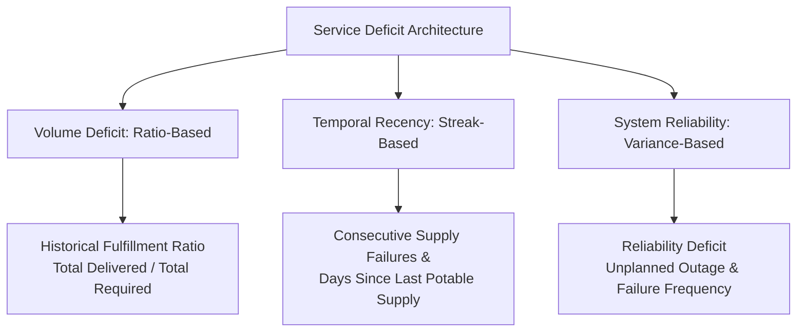

# WaterFlow OS — Service Deficit Modeling Methodology
**Version:** 2.0.0-research  
**Classification:** `ALGORITHMIC_FORMULATION`  
**Last Updated:** 2026-09-18  

---

## 1. Objective & Principle

In equitable water resource allocation, historical track records are essential to counteract systemic neglect. Communities situated at the periphery of water distribution networks or informal settlements frequently experience chronic under-supply compared to central elevated zones.

However, naive inclusion of multiple historical shortage metrics creates severe multicollinearity and double counting. For instance, feeding both `cumulative_unmet_demand` (Liters) and `average_unmet_demand` (Liters/day) into an allocation model essentially awards double priority for the exact same physical deficit across different arithmetic scales.

This methodology defines how service deficits are measured, bounded, and normalized without double counting.

---

## 2. Core Service Deficit Dimensions

To prevent overlap, we partition service deficit into three orthogonal dimensions:

### 2.1 Volume Deficit (Fulfillment Ratio)
Measures the aggregate proportion of required water actually received over a rolling 14-day window:
$$\text{Fulfillment Ratio } (FR) = \min\left(1.0, \frac{\sum_{t=1}^N S_{i,t}}{\sum_{t=1}^N D_{i,t}}\right)$$
The corresponding volume gap is simply:
$$\Delta_{\text{vol}} = 1.0 - FR$$

### 2.2 Temporal Recency & Acute Deprivation (Streak)
While volume ratio reflects macro-level sufficiency, a community that received zero water for 4 consecutive days experiences critical hydration and hygiene distress, even if their 14-day average appears moderate.
- $K_i$: Consecutive days where delivered water $< 50\%$ of minimum required lifeline quota.
- $T_{\text{streak\_cap}} = 7 \text{ days}$
$$\text{Streak Score } (\sigma_i) = \min\left(1.0, \frac{K_i}{7}\right)$$

### 2.3 Reliability Deficit (Variance & Outages)
Measures the unreliability of piped delivery (intermittent schedule instability, sudden dry-pipe hours):
$$R_i = \frac{\text{Failed Delivery Shifts} + \text{Unplanned Outages}}{\text{Total Scheduled Shifts}}$$

---

## 3. Composite Service Deficit Formulation ($H_i$)

To avoid double counting cumulative liters and average liters, the allocation factor $H_i$ synthesizes the three normalized dimensions using fixed linear weights:

$$H_i = 0.50 \cdot (1.0 - FR_i) + 0.30 \cdot \sigma_i + 0.20 \cdot R_i$$

### Properties:
1. **Bounded:** $H_i \in [0.0, 1.0]$.
2. **Dimensionless:** Does not bias towards wards with larger absolute populations or higher raw demand volume.
3. **Responsive to Acute Shocks:** A sudden 3-day outage immediately elevates $\sigma_i$, rapidly raising priority before waiting for 14-day averages to degrade.
4. **Resilient to Missing Observations:** If historical data is unavailable, the missing data policy injects a documented neutral baseline of $H_i = 0.50$ rather than 0.0 (which would falsely imply perfect historical service).
